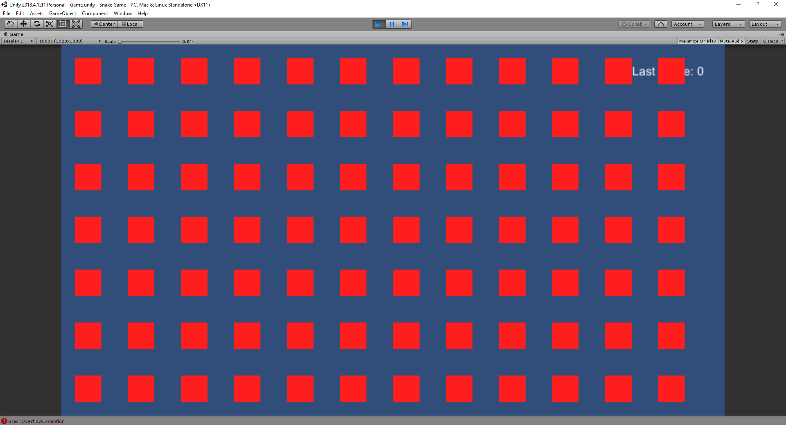
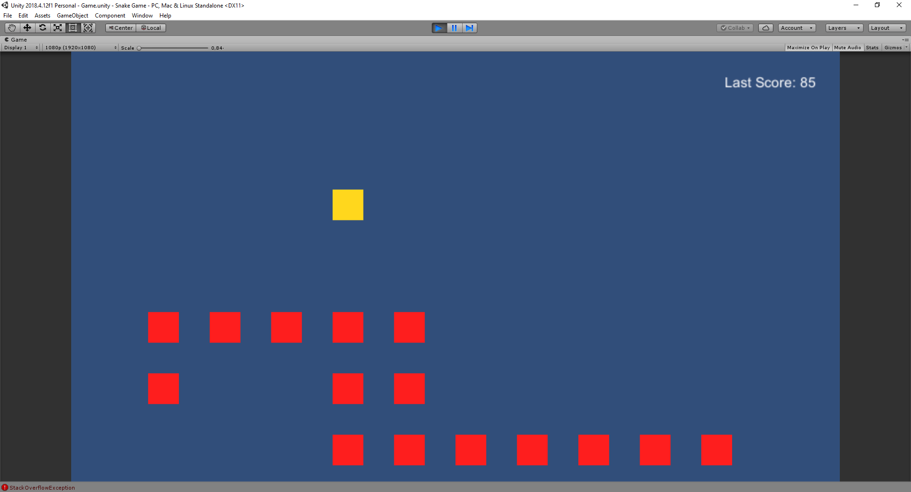
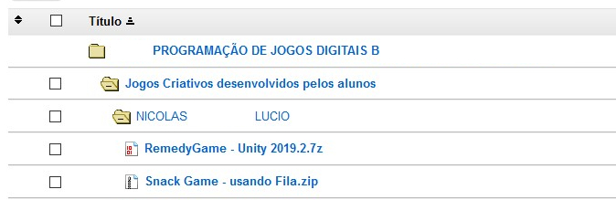

# Unity-SnakeGame-QueueStudy
A simple game made only with scripts and a single image.

This exemple use the 2018 LTS Unity Version (2018.4.12f1)

# Screenshot Exemples
How to win this game



A normal ingame exemple



# Additional Settings 

Is necessary to chance the screen size of the "Game" menu in Unity, to 1920x1080.


# Aditional Details

This game was made in class after an example of how to use the Queue function. So, only using this, it was, since the beginning, simple.

And now, this is a exemple game for the course. 

```
(Pontifícia Universidade Católica - Campinas - São Paulo - Brasil)
``` 


